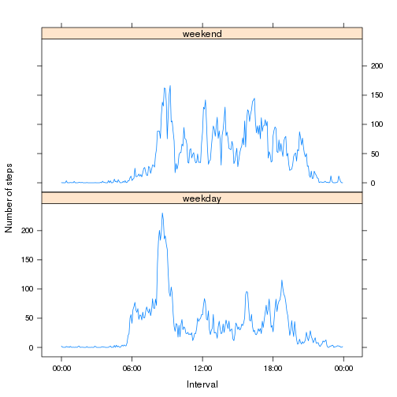

## Introduction
It is now possible to collect a large amount of data about personal movement using activity monitoring devices such as a Fitbit, Nike Fuelband, or Jawbone Up. These type of devices are part of the “quantified self” movement – a group of enthusiasts who take measurements about themselves regularly to improve their health, to find patterns in their behavior, or because they are tech geeks. But these data remain under-utilized both because the raw data are hard to obtain and there is a lack of statistical methods and software for processing and interpreting the data.

Here we make use of data from a personal activity monitoring device. This device collects data at 5 minute intervals through out the day. The data consists of two months of data from an anonymous individual collected during the months of October and November, 2012 and include the number of steps taken in 5 minute intervals each day.

## Loading and preprocessing the data
The data is available on [https://github.com/evgaster/RepData_PeerAssessment1] in the activity.zip file. You need to make that available locally for reading into R and further processing.

```r
unzip("activity.zip")
d <- read.csv("activity.csv")
str(d)
```

```
## 'data.frame':	17568 obs. of  3 variables:
##  $ steps   : int  NA NA NA NA NA NA NA NA NA NA ...
##  $ date    : Factor w/ 61 levels "2012-10-01","2012-10-02",..: 1 1 1 1 1 1 1 1 1 1 ...
##  $ interval: int  0 5 10 15 20 25 30 35 40 45 ...
```

The attribute *interval* seems to be represented as a single number encoding the hours and the minutes into the hour. The encoding looks like interval = hour \* 100 + minutes. Later on we need to work with date and interval in various *time* ways.

```r
d$timestamp <- as.POSIXlt(d$date)
d$timestamp$hour <- d$interval %/% 100
d$timestamp$min <- d$interval %% 100
d$time <- sprintf("%0.2d:%0.2d", d$timestamp$hour, d$timestamp$min)
```


## What is mean total number of steps taken per day?
The total number of steps taken per day is calculated by summing the value of steps over all intervals of a day. 

Note that we are ignoring missing values here. So strickly speeking these are not *total number of steps per day* but *total number of **reported** steps per day*.

```r
totalStepsByDay <- aggregate(steps ~ date, data = d, sum)
```

The histogram below gives an impression of how many days (y axis: Frequency) a certain number of steps (x axis: Total of reported steps per day) are reported.

```r
hist(totalStepsByDay$steps,
     main = "",
     xlab = "Total of reported steps per day"
     )
```

 


```r
meanOftotalStepsByDay <- as.integer(round(mean(totalStepsByDay$steps)))
medianOftotalStepsByDay <- as.integer(round(median(totalStepsByDay$steps)))
```
The mean of the total steps per day = 10766, its median = 10765.


## What is the average daily activity pattern?
An other view on the data is the number of steps over the course of the day. The average daily activity pattern is calculated by taking the mean of the number of reported steps per 5-minute interval, over all days.

```r
averageOfStepsByInterval <- aggregate(steps ~ time, data = d, mean)
```

The figure below gives an impression of this activity pattern (y axis: Average number of steps) over the day (x axis: Interval time).

```r
averageOfStepsByInterval$timestamp <- as.POSIXct(averageOfStepsByInterval$time, format = "%H:%M")
plot(averageOfStepsByInterval$timestamp, averageOfStepsByInterval$steps,
     type = "l",
     xlab = "Interval time",
     ylab = "Average number of steps"
     )
```

 


```r
# At what time of the day was this person the most active (on average over all days)?
maxAverageOfStepsIntervalTime <- averageOfStepsByInterval$timestamp[which.max(averageOfStepsByInterval$steps)]
maxAverageOfStepsInterval <- format(maxAverageOfStepsIntervalTime, format = "%H:%M")
```
The activity has its max at 08:35.

## Imputing missing values
There are a number of days/intervals where there are missing values.

```r
countOfMissingValues <- sum(is.na(d$steps))
```
The number of entries with missing steps value = 2304.

There are many approaches to handling missing values. Here we subsitute a missing value by the mean of the number of reported steps per 5-minute interval, over all days.

```r
m <- merge(d, averageOfStepsByInterval, by = "time")
m$steps.x[is.na(m$steps.x)] <- m$steps.y[is.na(m$steps.x)]

m <- data.frame(m$steps.x, m$date, m$interval, m$timestamp.x, m$time)
names(m) <- names(d)
```

The total number of steps taken per day is calculated again by summing the value of steps over all intervals of a day. 

```r
totalStepsByDay <- aggregate(steps ~ date, data = m, sum)
```

The figure below gives an impression of how many days (y axis: Frequency) a certain number of steps (x axis: Total of  steps per day) are reported or **imputed**

```r
hist(totalStepsByDay$steps,
     main = "With imputing for missing steps data",
     xlab = "Total of steps per day"
     )
```

 


```r
meanOftotalStepsByDay <- as.integer(round(mean(totalStepsByDay$steps)))
medianOftotalStepsByDay <- as.integer(round(median(totalStepsByDay$steps)))
```
The mean of the total steps per day = 10766, its median = 10766.
This hardly differs from the values obtained previously (without imputing missing values).

Why this is become immediatly clear when we look at where the values are missing.

```r
table(d[is.na(d$steps),]$date)
```

```
## 
## 2012-10-01 2012-10-02 2012-10-03 2012-10-04 2012-10-05 2012-10-06 
##        288          0          0          0          0          0 
## 2012-10-07 2012-10-08 2012-10-09 2012-10-10 2012-10-11 2012-10-12 
##          0        288          0          0          0          0 
## 2012-10-13 2012-10-14 2012-10-15 2012-10-16 2012-10-17 2012-10-18 
##          0          0          0          0          0          0 
## 2012-10-19 2012-10-20 2012-10-21 2012-10-22 2012-10-23 2012-10-24 
##          0          0          0          0          0          0 
## 2012-10-25 2012-10-26 2012-10-27 2012-10-28 2012-10-29 2012-10-30 
##          0          0          0          0          0          0 
## 2012-10-31 2012-11-01 2012-11-02 2012-11-03 2012-11-04 2012-11-05 
##          0        288          0          0        288          0 
## 2012-11-06 2012-11-07 2012-11-08 2012-11-09 2012-11-10 2012-11-11 
##          0          0          0        288        288          0 
## 2012-11-12 2012-11-13 2012-11-14 2012-11-15 2012-11-16 2012-11-17 
##          0          0        288          0          0          0 
## 2012-11-18 2012-11-19 2012-11-20 2012-11-21 2012-11-22 2012-11-23 
##          0          0          0          0          0          0 
## 2012-11-24 2012-11-25 2012-11-26 2012-11-27 2012-11-28 2012-11-29 
##          0          0          0          0          0          0 
## 2012-11-30 
##        288
```
This shows that only complete days are missing. Those days get the average of the other days imputed. So they become an average day. And where does an average day ends up in the histogram?

## Are there differences in activity patterns between weekdays and weekends?

To see if the activity pattern differs between the typical work and weekend days we need to make that piece of information explicit.

```r
m$dayType <- "weekday"
m$dayType[weekdays(m$timestamp) %in% c("Saturday", "Sunday")] <- "weekend"
m$dayType <- as.factor(m$dayType)
```

The average daily activity pattern is calculated by taking the mean of the number of reported steps per 5-minute interval, over the different types of days.

```r
averageOfStepsByInterval <- aggregate(steps ~ time + dayType, data = m, mean)
```

The figure below gives an impression of the activity pattern (y axis: Number of steps) over the day (x axis: Interval) for both weekdays and weekend.

```r
averageOfStepsByInterval$timestamp <- as.POSIXct(averageOfStepsByInterval$time, format = "%H:%M")

library(lattice)
p <- xyplot(steps ~ timestamp | dayType,
            averageOfStepsByInterval,
            type = "l",
            xlab = "Interval",
            ylab = "Number of steps",
            layout = c(1, 2),
            scales = list(x = list(format = "%H:%M"))
            )
print(p)
```

 

In the weekend the activity is more spread out. On weekdays it peaks in the morning rush hour.

